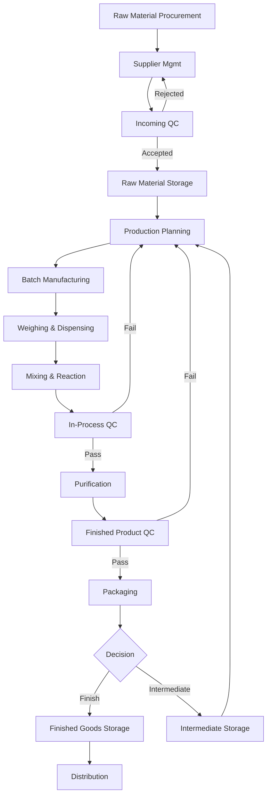

# Project Summary & Technical Specifications

This document consolidates the target design for a customized Dolibarr ERP focused on chemical manufacturing, with Indian GST and Karnataka compliance, and ISO 14001/14076 alignment.

Note on references: Dolibarr official documentation is authoritative. Where non-official references are used (GST/ISO summaries), they are indicated as non-official.

## 1. Project Overview & Architecture
- Objective: Configure and extend Dolibarr for batch and continuous chemical manufacturing, ISO 14001/14076 alignment, Indian GST/Karnataka compliance, with import/export.
- Environments:
  - Dev: GitHub Codespaces (Dockerized)
  - Staging/Prod: CloudClusters.io (target), alternatives DO/AWS ECS/VPS
- High-level architecture:
  - Nginx reverse proxy → PHP-FPM (Dolibarr) → MariaDB/PostgreSQL
  - Optional services: Redis (sessions/cache), ClamAV (file scanning), SMTP relay
- Data segregation: Separate databases per environment; distinct `documents/` trees.

Decisions (Nov 2025):
- Database engine: MariaDB (selected). PostgreSQL not targeted initially.
- Redis: optional; disabled by default in this project layer (can be enabled later).
- Product sub-classifications: to be provided during configuration; operations and reports will validate that every product is tagged to a class/sub-class.

## 2. Detailed Manufacturing Flowchart

Key inputs captured at each stage are detailed in Section 3.

## 3. Input Requirements & Data Tracking
### 3.1 Raw Material Inputs
- Supplier profiles (GSTIN, certifications), import/export docs
- Specifications (CAS, purity, hazards, GHS pictograms)
- Docs: SDS/COA/TDS, audits
- Storage and QC parameters
- Multi-vendor catalog with barcodes and variants

### 3.2 Production Inputs
- Batch Manufacturing Records (BMR/BPR) with scanned documents
- Weights, yields; parameters (T, P, time, pH)
- Equipment usage, calibration, barcodes
- Environment (room T/RH)
- Operator e-signatures
- Finished product DB with barcodes/variants

### 3.3 Quality Control Checkpoints [QC_CHECKPOINTS]
- Incoming QC, In-Process QC, Finished Product QC
- Testing Methods DB, R&D records similar to production

### 3.4 Equipment Management
- Barcode for all equipment; specs/calibration; maintenance scheduling; usage lifecycle

## 4. User Hierarchy & Permissions [USER_ROLES]
- Production: Manager, Supervisor, Operator
- Quality: QC Manager, QC Analyst
- Stores: Store Manager, Store Keeper
- EHS: EHS Officer
- R&D: R&D Manager, Research Scientist
- HR: HR Manager, HR Executive

Implementation notes:
- Map roles to Dolibarr user groups with granular module rights (Production, Stock, BOM/MRP, Projects, ECM, HRM, Accounting, GDPR/WAF).
- Enforce confidentiality for proprietary formulations (restricted categories and document ACLs via ECM and product variants).

## 5. CRM & Billing for Indian Market
- GST specifics: GSTIN, HSN/SAC, Place of Supply, CGST/SGST/IGST, reverse charge, QR code for B2C > ₹50k.
- Import/Export: shipping bills, customs declarations, drawback support, customs duty tracking.
- Customer segmentation: by business type/geography/product category.
- Sales flow: Lead → Qualification → Quote → Sample → Order → Post-sale.
- Payment terms: advance, balance on delivery, LC (export), credit terms.

Dolibarr modules: Proposals/Orders/Invoices, Multicurrency, Margin, Thirdparties, Accounting, Shipping, Projects, Emailing, and custom GST enhancements.

GST e-invoicing / QR (India): Confirmed requirement. Implementation to include fields for IRN, Ack No/Date, QR payload storage/display, HSN/SAC, Place of Supply, and GST rate breakdown. Integration specifics (portal/GSP APIs) to be finalized; see `project/config/gst/e_invoicing_requirements.md` (non-official checklist, validate with current government guidance).

## 6. ISO 14001 & 14076 Compliance
- Environmental aspects: material usage, energy, waste, emissions, permits
- Carbon footprint (14076): material/energy factors, transport, waste treatment
- Tracking: custom extra fields on products, BOMs, batches; periodic reports; document control via ECM.

## 7. Deployment Strategy
- Target CloudClusters.io with hardened Nginx and PHP-FPM (see `SECURITY_HARDENING.md`).
- Separate env vars per environment; read-only code; backups of DB and `documents/`.
- Observability: access logs, error logs, optional reverse proxy metrics.
- Disaster recovery: scheduled dumps + offsite copy; restoration runbook.

## 8. Next Steps & Open Questions
- Confirm product sub-classifications (bulk, specialty, formulations → sub-categories).
- Decide DB engine (MariaDB vs PostgreSQL) and Redis usage.
- Validate GST QR and e-invoicing integration requirements.
- Define exact user groups and permissions matrix.
- Approve carbon factors sources for 14076.

---

## Module Mapping (initial)
- Core: Third Parties, Products/Services, Warehouse/Inventory, Projects, Proposals, Orders, Invoices, Accounting, Shipments, BOM/MRP, Manufacturing Orders (MRP), ECM, Emailing.
- Quality & EHS: Custom modules for QC checkpoints, Equipment calibration, EHS logs; leverage Extra Fields and ECM for SDS/COA.
- HR: HRM module configured for Karnataka compliance (non-official checklist to be attached).

## Data Privacy & Confidentiality
- Proprietary formulations: restricted categories, private documents, group ACLs. Use `htdocs/ecm/` and product variant visibility.

## Validation & Testing
- Define fixtures and UAT scripts (no population yet). Add smoke tests for routes and permissions in later iterations.
